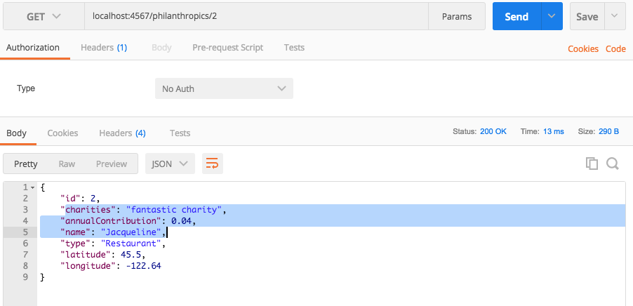

# Human Kindness Business API 

##### Epicodus Section: Java Week4 : Advanced Java Topics

### By Jessica Sheridan

## Description

Provide API to find businesses based on the charitable donations and/or
their employment offerings for all humans. Future development to put
together tours based on the addresses of selected businesses. 

## Test Plan 

| Behavior      | Input | Output |
| ------------- | ------------- | ------------- |

## Postman Verification

## Setup
git clone https://github.com/jessicakenney/human-kindness.git  
bring up url: localhost:4567

## Support and Contact details
email with any questions: jessicakenney@yahoo.com,

## Known Issues/Bugs

## Technologies Used
Java, Spark, Handlebars

### Legal
This software is licensed under MIT Copyright (c) 2017 Jessica Sheridan
